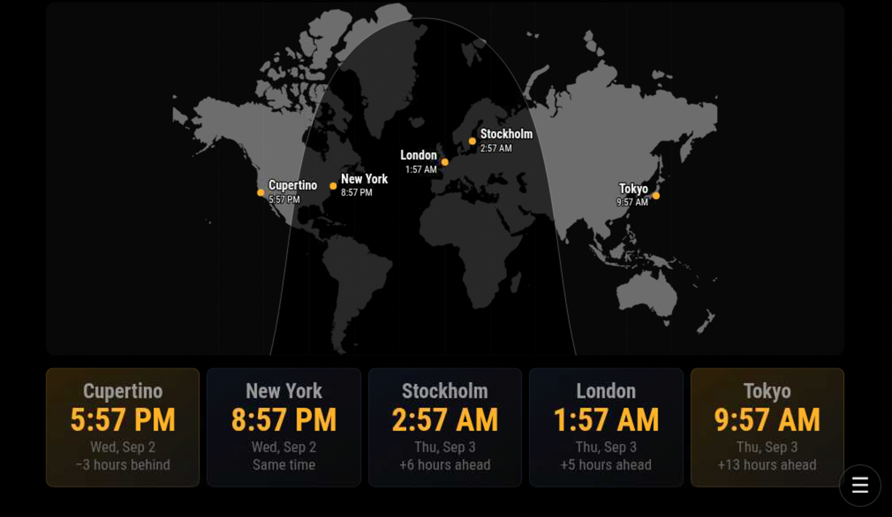
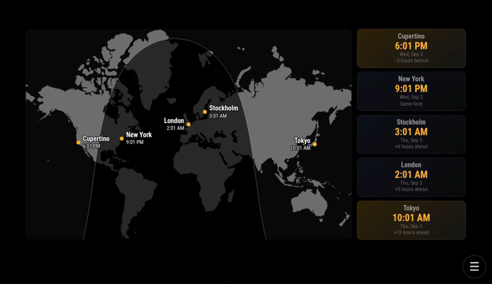
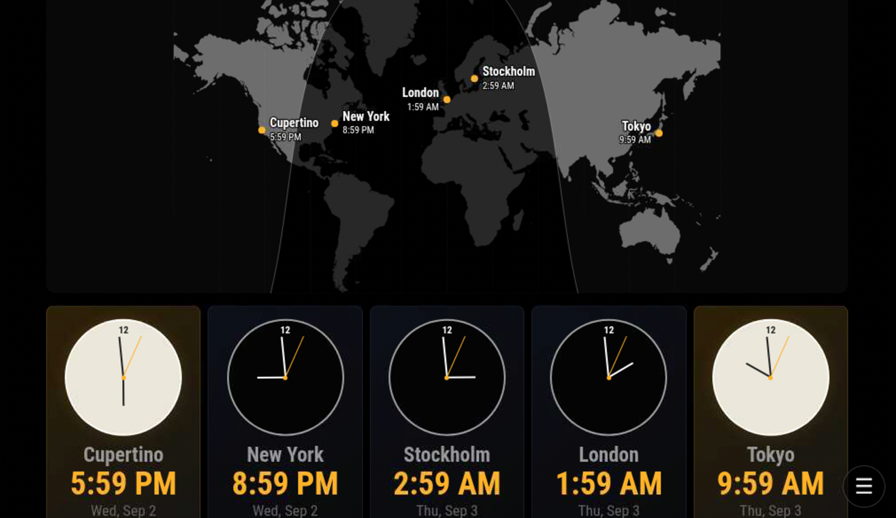

# MMM-WorldClockMap

A MagicMirror² module for seeing at a glance whether friends, family, and contacts around the world are likely to be awake.

## Features

- Three purpose-built layouts: full-width `large`, split-view `compact`, and stacked `line`
- Accurate IANA timezones and daylight-saving changes through `Intl.DateTimeFormat`
- Ambient warm daytime and cool nighttime card tints
- Optional analog clocks, localized dates, seconds, time differences, and exact sun times
- Offline SVG world map with city markers and a continuously calculated solar terminator
- All 47 current MagicMirror language files with English fallback
- No API keys, remote scripts, location service, or runtime dependencies
- Keyboard-safe semantic output and screen-reader labels
- `WORLD_CLOCK_MAP_REFRESH` notification for optional integrations

The map is intentionally low-detail so it remains crisp and inexpensive to render on a Raspberry Pi. City coordinates are supplied by the user and never transmitted. The default cards favor local time and ambient daylight state over dense astronomical detail.

## Development status

**Beta and actively maintained.** The module has been exercised on the Seymour MagicMirror appliance at 1024×600. Validation on a second, ordinary MagicMirror installation is planned before declaring the first stable release.

## Screenshots

### Large layout



### Compact layout



### Large layout with analog clocks



These beta screenshots were captured on Seymour. The circular menu control at the lower right belongs to the host interface and is not part of MMM-WorldClockMap.

## Installation

```sh
cd ~/MagicMirror/modules
git clone https://github.com/bwente/MMM-WorldClockMap.git
```

No `npm install` is needed for normal use.

## Configuration

Add the module to `config/config.js`:

```js
{
  module: "MMM-WorldClockMap",
  position: "top_center",
  config: {
    layout: "large",
    showMap: true,
    clocks: [
      {
        label: "Cupertino",
        timeZone: "America/Los_Angeles",
        latitude: 37.323,
        longitude: -122.0322
      },
      {
        label: "New York",
        timeZone: "America/New_York",
        latitude: 40.7128,
        longitude: -74.006
      },
      {
        label: "Stockholm",
        timeZone: "Europe/Stockholm",
        latitude: 59.3293,
        longitude: 18.0686
      }
    ]
  }
}
```

Use a wide region such as `top_center`, `middle_center`, `bottom_center`, or `fullscreen_above` for the map. Set `showMap: false` for a conventional sidebar clock list.

### Module options

| Option | Type | Default | Description |
| --- | --- | --- | --- |
| `layout` | string | `"compact"` | `"large"` places a full-width map above a full-width clock row; `"compact"` places the map beside a vertical clock stack; `"line"` shows only a single stack of full-width clock tiles. |
| `clocks` | array | New York, London, Tokyo | Clock definitions described below. |
| `showMap` | boolean | `true` | Show the offline realtime day/night map in large or compact layout. Line layout intentionally omits it. |
| `showAnalog` | boolean | `false` | Show analog faces. In line layout, each face sits on the left inside its tile. Daylight faces use a light dial. |
| `showSeconds` | boolean | `false` | Include seconds in digital times. |
| `showDate` | boolean | `true` | Show each location's localized date. |
| `showTimeDifference` | boolean | `true` | Show offset from `referenceTimeZone` or the mirror timezone. |
| `showSunTimes` | boolean | `false` | Show exact calculated sunrise and sunset. Off by default for glanceability. |
| `showDayNightTint` | boolean | `true` | Warmly tint daylight cards and coolly tint nighttime cards. |
| `referenceTimeZone` | string/null | `null` | IANA timezone used for differences. `null` uses the mirror timezone. |
| `timeFormat` | string | `"auto"` | `"auto"`, `"12"`, or `"24"`. Auto follows the locale. |
| `mapHeight` | number | `260` | Map height in CSS pixels, with a minimum of 120. |
| `mapLabelSize` | number | `18` | Desired city-label height in rendered CSS pixels, clamped from 12 to 48. It remains visually constant when `mapHeight` changes. |
| `updateInterval` | number/null | `null` | Refresh interval in milliseconds, clamped to at least one second. Auto uses 30 seconds normally or one second when showing seconds. |
| `animationSpeed` | number | `0` | MagicMirror DOM transition time. Zero avoids a flash every second. |
| `accentColor` | string | `"#ffb229"` | CSS color for clock times, second hands, and map markers. |

### Clock options

| Option | Required | Description |
| --- | --- | --- |
| `timeZone` | yes | IANA timezone such as `Asia/Kolkata`. |
| `label` | no | Display name. The timezone is used when omitted. |
| `latitude` | for map/sun times | Decimal latitude from -90 to 90. |
| `longitude` | for map/sun times | Decimal longitude from -180 to 180. |

Coordinates are optional as a pair. A clock without coordinates still displays time and date, but has no map marker, daylight tint, or sunrise/sunset rows.

## Layout examples

```js
// Full-width map over a full-width clock row
config: { layout: "large", mapHeight: 360 }

// Map at left, vertically stacked clocks at right
config: { layout: "compact", showMap: true }

// A single stack of tiles, optionally with clock faces at left
config: { layout: "line", showAnalog: true }
```

## Notifications

| Notification | Direction | Payload | Purpose |
| --- | --- | --- | --- |
| `WORLD_CLOCK_MAP_REFRESH` | incoming | none | Immediately refresh the displayed time and map. |

Companion integrations are optional; the module works normally without them.

## Localization

The module includes every locale currently shipped by MagicMirror², from Afrikaans (`af`) through Traditional Chinese (`zh-tw`). `Intl` localizes clock and calendar output. English is the complete fallback, translation keys are kept identical, and locale files are checked in tests.

Run `npm test` before contributing. The tests also verify that every locale has exactly the English translation keys.

## Similar modules and design context

- [MMM-Worldclock](https://github.com/ulrichwisser/MMM-Worldclock) displays multiple timezone clocks and inspired the familiar multi-clock use case.
- MagicMirror's [default clock](https://docs.magicmirror.builders/modules/clock.html) documents the platform's expected timezone and 12/24-hour behavior.
- The official [module development guide](https://docs.magicmirror.builders/development/core-module-file.html) defines the lifecycle, DOM, styling, and translation APIs used here.

MMM-WorldClockMap differs by combining responsive clock presentations with an offline solar map, ambient daylight status, optional coordinate-based sun times, semantic output, and current localization practices.

## License

The module's original source code and documentation are available under the MIT License.

The bundled [`worldOutlineLow.svg`](worldOutlineLow.svg) map is adapted from the amCharts [World Outline SVG map](https://www.amcharts.com/svg-maps/?map=worldOutline) and is licensed separately under [Creative Commons Attribution-NonCommercial 4.0 International](https://creativecommons.org/licenses/by-nc/4.0/). It may be shared and adapted with attribution for non-commercial purposes. Commercial use requires separate permission or an appropriate amCharts license. The map content visible in the bundled screenshots is subject to the same terms.

See [THIRD_PARTY_NOTICES.md](THIRD_PARTY_NOTICES.md) for complete attribution and a description of the modifications.
